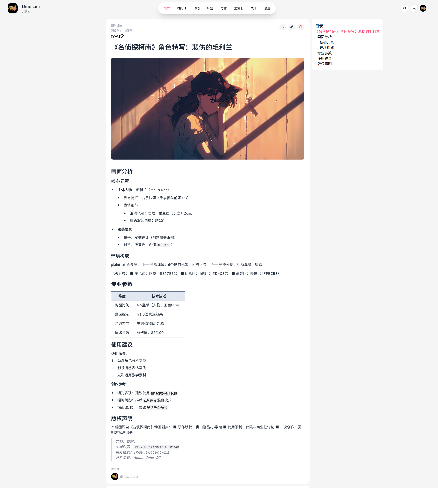
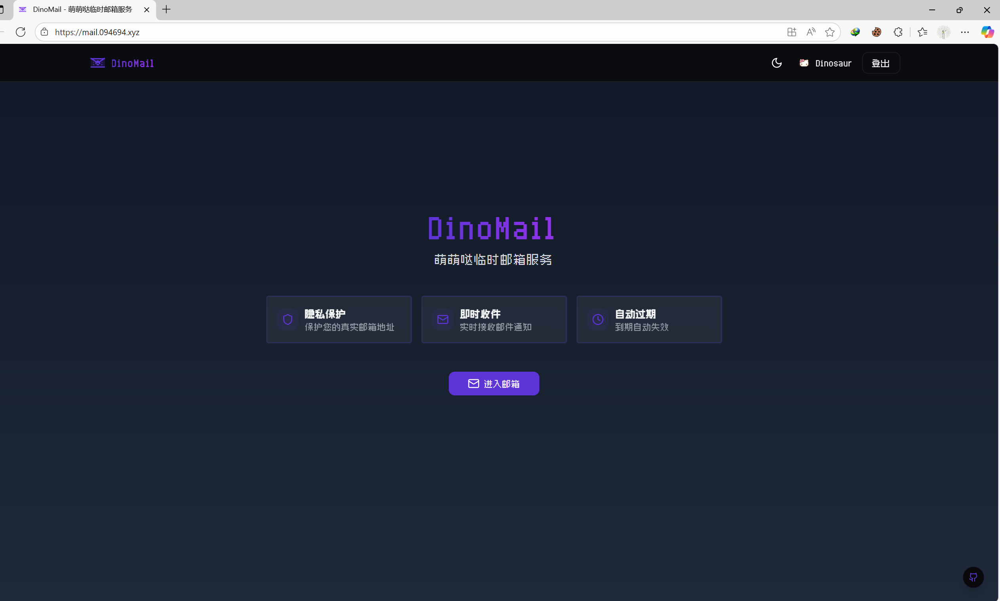
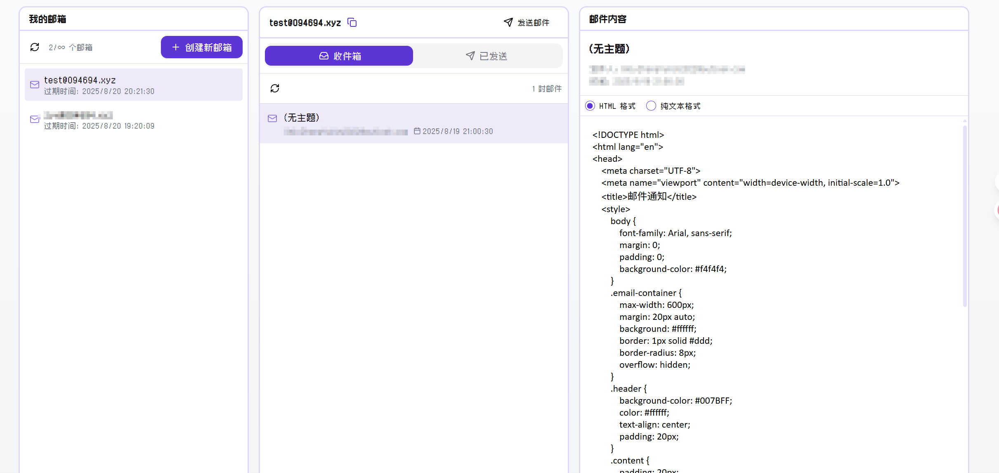
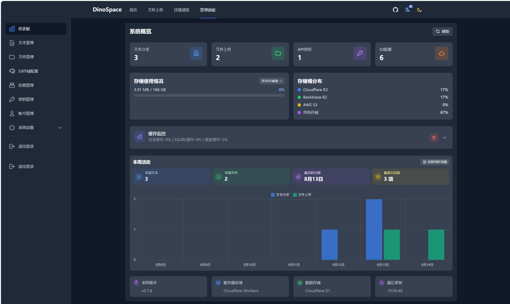
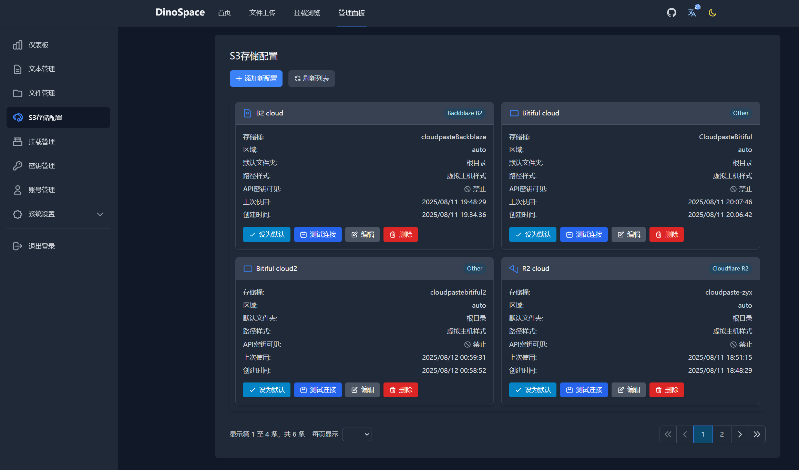
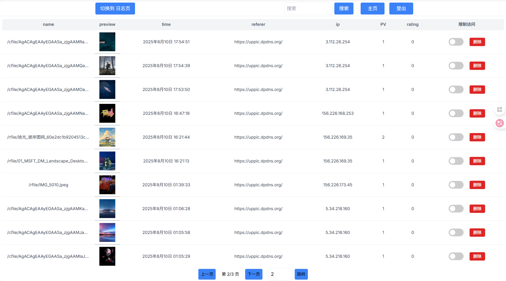
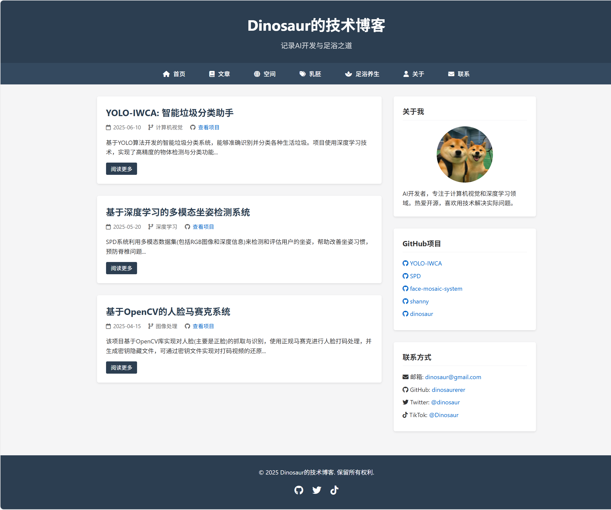
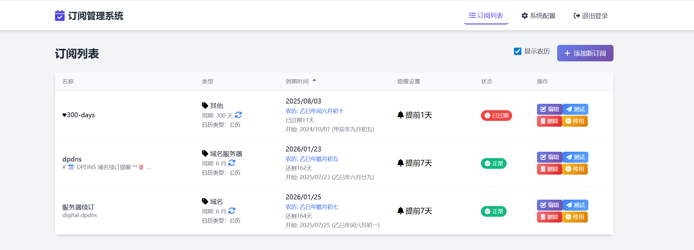

# WebHub — 个人网站与服务导航

WebHub汇总了我开发和部署的各类网站与服务，涵盖个人博客、云盘、图床、纪念站、订阅管理等，方便快速访问与维护。  
每个项目附 简要介绍、访问链接等。  

---

## 📝 1. 个人博客网站
**链接**：[https://blog.072416.xyz/](https://blog.072416.xyz/)  
**GitHub 仓库**：[Blog 仓库链接](https://github.com/dinosaurerer/Dino-blog)  
一个记录技术分享、个人随笔与学习笔记的博客网站，支持 Markdown 编写与分类归档。  
> _Blog_  

---

## 📧 2. 临时邮箱服务

链接：https://mail.094694.xyz/  
**GitHub 仓库**：[Mail 仓库链接](https://github.com/dinosaurerer/Dino-mail)  
一个萌系风格的临时邮箱服务，帮你快速生成一次性邮箱地址，有效隔离垃圾邮件🎀  

_Features_  

✨ 即开即用的临时邮箱地址  
⚡️ Cloudflare 边缘网络加速  
🐰 治愈系UI动画与主题配色  
📨 支持邮件内容实时渲染  

  
 

（注：实际展示时可替换为真实界面截图）

---

## ☁️ 2. 个人云盘
**链接**：[https://cloud.072416.xyz](https://cloud.072416.xyz)  
**GitHub 仓库**：[Cloud 仓库链接](https://github.com/dinosaurerer/Dino-cloud)  
基于 S3 存储构建的个人云盘系统，支持文件上传、分享、密码保护、WebDAV 挂载等功能。  
> _DinoSpace_  

---

## 🖼 3. 图床系统（CF-Telegrapm）

  高效稳定的在线图床系统，支持图片直链、Markdown 链接生成、批量上传，基于 Cloudflare 与 Telegraph 搭建。

**Dino-ImgHub(最新图床)**
**链接**：[https://imgbed.072416.xyz/](https://imgbed.072416.xyz/)  
**GitHub 仓库**：[imgbed 仓库链接](https://github.com/dinosaurerer/Dino-ImgBed)

**Dino-uppic(老版本图床)**
**链接**：[https://uppic.dpdns.org/](https://uppic.dpdns.org/)  
**GitHub 仓库**：[Imbox 仓库链接](https://github.com/dinosaurerer/Dino-imgbox)  
 
> _Imbed_  

> _Imbox_  

---

## 👬 4. 大学友谊纪念网站
**链接**：[https://zsyxy.dpdns.org/](https://zsyxy.dpdns.org/)  
**GitHub 仓库**：[DinoFriends 仓库链接](https://github.com/dinosaurerer/Dino-BE)  
纪念大学时期七人友谊的专题网站，记录了照片、文字与故事，承载着美好回忆。  
> _DinoFriends_  

---

## 📅 5.    
**链接**：[https://zhyx.qzz.io/](https://zhyx.qzz.io/)  
**cloudflare workers**：[SubsTracker](https://remind-dpdns.1465515385.workers.dev)  
一个帮助管理订阅与事务提醒的系统，可以设置订阅到期提醒、账单提示等。  
> _SubsTracker_  

---

## 🗄 6. Cloudflare R2 配置网站
**链接**：[https://blogimage.072416.xyz](https://blogimage.072416.xyz)  
**cloudflare dashboard**：[cloudflare dashboard](https://dash.cloudflare.com/)  
利用 Cloudflare R2 存储构建的静态资源网站，用于博客图片等静态文件的存储与访问。  
> _DinoR2_  

---

## 🔄 7. 中转域名与后端服务

<strong>网盘后端</strong>: <a href="https://zjysly.dpdns.org">https://zjysly.dpdns.org</a> 
<strong>原博客后端（已废弃）</strong>: <a href="https://blogbackend.dpdns.org">https://blogbackend.dpdns.org</a> 
<strong>现博客后端</strong>: <a href="https://blogbackend.072416.xyz">https://blogbackend.072416.xyz</a>

<em>中转域名主要用于 API 接口与文件中转，支撑前端网站的运行。</em>

---

## 📌 关于

<strong>域名太多了，凭着自己管理困难，未来会使用统一的域名或子域名来简化访问。</strong>

